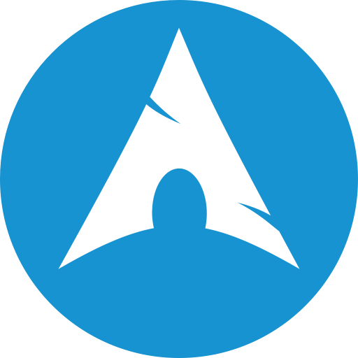
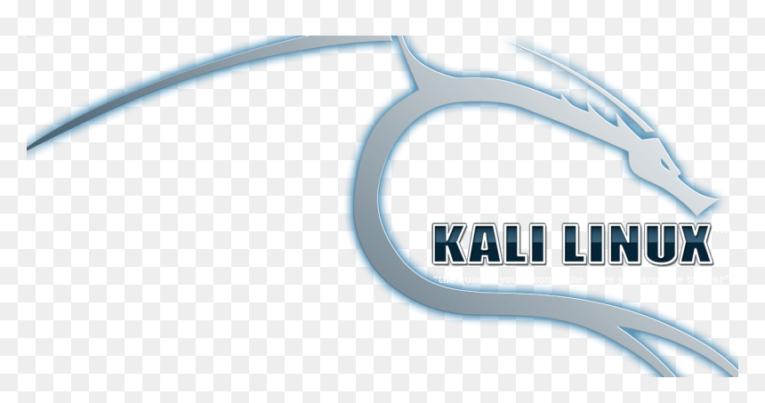
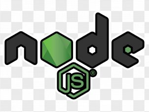
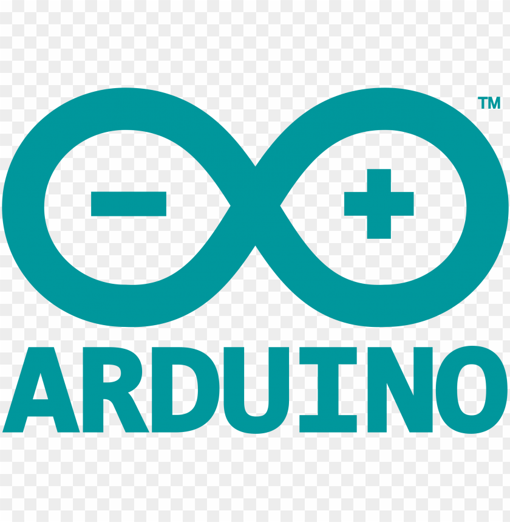
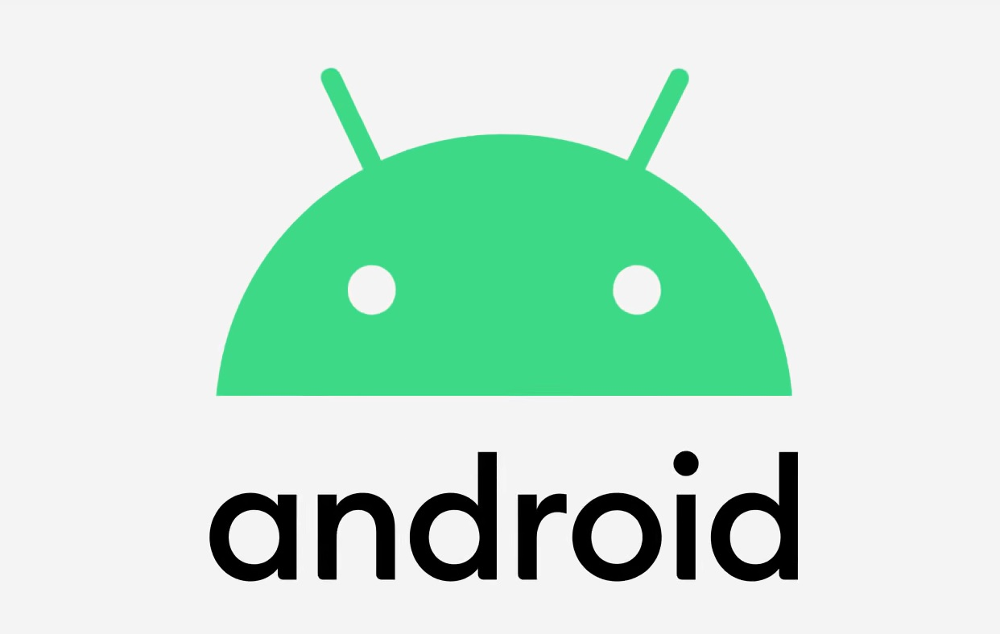

<h2> 𝐇𝐞𝐥𝐥𝐨 <𝚍𝚎𝚟𝚎𝚕𝚘𝚙𝚎𝚛𝚜/>!  </h2>

 
    
  
You have finally discovered my Github profile.  
Please feel free to clone/fork projects, raise issues and submit PRs if you think something could be better.  

<i>Happy Coding!</i> 😊

### About Me

:arrow_right: &nbsp;I like to explore new technologies and develop software solutions and quick hacks.\
:arrow_right: &nbsp;I'm graduated in Computer Science and Mathematics at the University of Perugia (Unipg).\
:arrow_right: &nbsp;I am open source (..and Linux :penguin:) enthusiast.\
:arrow_right: &nbsp;I had worked on libreoffice as free contributor. <a href="https://github.com/giacco/giacco/blob/main/img/personal/Filippo%20giacche%CC%80.pdf">[LO]</a> \
:arrow_right: &nbsp;I have developed some application for XEROX MFD eg:<a href="https://appgallery.services.xerox.com/#!/home/app-details/3741a1da-0a7f-44ba-a662-87ccaaaa6cb8">MC Counter pro</a> ... and much more ... \
:arrow_right: &nbsp;Please have a look at my <a href="https://github.com/giacco/giacco/blob/main/img/personal/Filippo%20giacche%CC%80.pdf">[CV]</a> for more details about me. I'm open to feedback and suggestions! NOTE: it is in Italian language.\
:arrow_right: &nbsp;In my free time... Music ... :musical_note: :musical_keyboard: :musical_score: :guitar: :guitar: :metal: \

### Skills 
<code></code>
<code></code>
<code></code>
<code></code>
<code></code>
<code></code>
<code></code>
<code></code>
<code></code>
<code></code>

### Currently Getting Familiar
<code></code>
<code></code>
<code></code>
<code></code>
<code></code>

### 🤝🏻 &nbsp;Contatct

<code></code>
<code></code>

